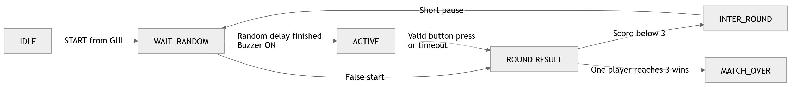

# Lab 6 - Reaction Game with Actuators

**Course:** ENCE 3608 – Introduction to Embedded Systems  
**Instructor:** Dr. Alexz Farrall  
**Lab Number & Title:** Lab 6 - Reaction Game with Actuators 
**Student Name:** Farid Ibadov  
**Student ID:** 17954  
**Program / Section:** BSCE26  
**Date:** May, 2026  

---

## 0. Table of Contents

- [1. Objectives](#1-objectives)
- [2. Theoretical Background](#2-theoretical-background)
  - [2.1 Actuation and Control](#21-actuation-and-control)
  - [2.2 Electric Motor Principle](#22-electric-motor-principle)
  - [2.3 Back EMF and Inductive Load](#23-back-emf-and-inductive-load)
  - [2.4 Servo Motor](#24-servo-motor)
  - [2.5 Stepper Motor and ULN2003 Driver](#25-stepper-motor-and-uln2003-driver)
  - [2.6 Start Signal](#26-start-signal)
- [3. Hardware & Configuration](#3-hardware--configuration)
  - [3.1 System Components](#31-system-components)
  - [3.2 Pin Mapping](#32-pin-mapping)
  - [3.3 Configuration Choices](#33-configuration-choices)
  - [3.4 Serial Configuration](#34-serial-configuration)
- [4. Implementation (full codes in the GitHub link below)](#4-implementation-full-codes-in-the-github-link-below)
  - [4.1 General Program Logic](#41-general-program-logic)
  - [4.2 Arduino State Machine](#42-arduino-state-machine)
  - [4.3 Setup Function](#43-setup-function)
  - [4.4 Main Loop](#44-main-loop)
  - [4.5 Random Waiting and False Start](#45-random-waiting-and-false-start)
  - [4.6 Reaction Time Measurement](#46-reaction-time-measurement)
  - [4.7 Round Winner and Actuator Response](#47-round-winner-and-actuator-response)
  - [4.8 Stepper Motor Control](#48-stepper-motor-control)
  - [4.9 Match End](#49-match-end)
  - [4.10 GUI Communication and Data Handling](#410-gui-communication-and-data-handling)
- [5. Results & Evidence](#5-results--evidence)
  - [5.1 Circuit and Physical Setup](#51-circuit-and-physical-setup)
  - [5.2 GUI and Serial Communication Evidence](#52-gui-and-serial-communication-evidence)
  - [5.3 Reaction Time and Round Result Test](#53-reaction-time-and-round-result-test)
  - [5.4 False Start Test](#54-false-start-test)
- [7. Conclusion](#7-conclusion)
- [8. References](#8-references)

---
## 1. Objectives

In this lab, the objective was to design and implement a 2-player reaction game using two push buttons, buzzer, servo motor, stepper motor with ULN2003 driver, with a supplementary Graphical User Interface.

The system was not only supposed to read bare inputs - it is additionally expected to physically react through specific actuators. After both players enter their names in the GUI and start match, Arduino generates a random waiting time in the interval from 1 to 20 seconds. When this time ends, the system provides the start signal using buzzer, and both players press their buttons as fast as possible. Their reaction times are measured, recorded and compared. The faster player wins the round.

The winner is then shown in two ways:
- servo motor points toward the winning side.
- stepper motor moves one increment in that player’s direction. 
 
If a player presses too early, this is treated as a false start and the point is given to the opponent.

Whenever one player reaches 3 round wins, the stepper motor performs a full victory spin, the GUI displays corresponding match winner by name, and both round and match results are saved into two separate CSV files.

---

## 2. Theoretical Background

### 2.1 Actuation and Control

In this lab Arduino controls several outputs:

- buzzer -> as an audio signal,
- servo motor -> as a position indicator,
- stepper motor -> mechanical score indicator,
- GUI -> user-side control and data interface.

The full system can be understood as small closed interaction loop:


### 2.2 Electric Motor Principle

An electric motor converts electrical energy into mechanical energy, usually in the form of rotation or torque. The basic idea is that current passing through a coil creates a magnetic field. Motor, consisting of rotor with several winded coils and stator usually constructed out of static magnets, works on the principle of attraction/repulsion between the magnetic fields created by rotor's coils and stator's magnets.   


$$B = k \cdot I_{ph}$$

where:
- $B$ - magnetic field,
- $k$ - motor-dependent constant,
- $I_{ph}$ - phase current.

Higher current creates stronger magnetic field. 

As mentioned before, in motors, motion appears because rotor and stator magnetic fields attract or repel each other accordingly, where produced torque depends both on magnetic field strength and on the angle between fields:

$$T_q \propto B_{rot} \cdot B_{sta} \cdot \sin(\theta)$$

The maximum torque is reached when the load angle is near $90^\circ$, since:

$$\sin(90^\circ)=1$$

### 2.3 Back EMF and Inductive Load

In addition to acting as a resistor, a motor coil also exhibits inductor properties. While resistance is largely determined by the material of the conductor, inductance is determined by the shape of the coil. Therefore, a motor phase can be simplified as an $R-L$ load.


When the current flowing through the inductor changes, the coil resists this sudden change - this is why current in the motor does not jump instantly to its final value, but instead gradually increases or decreases.

When motor rotates, it produces voltage that opposes the supply voltage. This is called Back Electromotive Force, or BEMF:

$$V_{BEMF}=k_e \cdot Speed$$

As motor spins faster, it creates more opposing voltage, which is one of the reasons why motor control needs a driver circuit and cannot be treated like a simple LED.

### 2.4 Servo Motor

A servo motor is used when the system requires angular position control, rather than continuous, uncontrolled rotation as with conventional DC motors. In this lab, the servo motor is used as a trivial indicator, indicating which player has won the current round.


The servo receives a PWM control signal from the Arduino. Different pulse widths correspond to different angles. In the lab, one side is considered as player 1, the other - player 2, and the center is the neutral position. In the code, this is simplified as follows:

- $90^\circ$ = neutral.
- $0^\circ$ = Player 1 wins.
- $180^\circ$ = Player 2 wins.

### 2.5 Stepper Motor and ULN2003 Driver

Unlike a conventional DC motor, stepper motor rotates in small, discrete steps. This makes it useful when position changes need to be gradual and clear. This property makes stepper motors very precise. It's no wonder they're used in applications like 3D printer heads, where margins of error must be minimal.

In this lab, stepper motor acts as a physical clock for a tug-of-war game. Each round won by one player moves the shaft toward his/her direction, and each round won by another moves it in the opposite direction.


28BYJ-48 Stepper motor used in this lab is controlled through a half-step sequence. The program energizes motor coils in a specific order, and this creates rotation. In the code, one full revolution is considered:

$$4096\;steps \approx 360^\circ$$

For each round win, the motor moves:

$$\frac{4096}{12} \approx 341\;steps$$

which is approximately:

$$\frac{360^\circ}{12}=30^\circ$$

The ULN2003 driver is necessary because the Arduino's GPIO pins cannot directly supply sufficient current to the motor windings. The driver acts as an intermediate current switching stage. The Arduino sends small logic signals to the ULN2003 inputs, and the ULN2003 switches the higher current to the motor winding on the output side. It also protects the circuit from voltage surges generated by inductive coils.


Note that, is important to connect the stepper motor driver supply to 5V instead of 12V since the used 28BYJ-48 stepper is rated for 5V. Applying 12V would force excessive current through its coils. This can cause overheating and possible motor or driver damage.

### 2.6 Start Signal

The buzzer is used as a start signal. Once triggered, the Arduino begins measuring the reaction time. However, if the button is pressed before the buzzer is triggered, it is counted as a false start.

---

## 3. Hardware & Configuration

### 3.1 System Components

The main components used in the circuit were:

- Arduino Uno,
- 2 push buttons,
- buzzer,
- servo motor,
- 28BYJ-48 stepper motor,
- ULN2003 stepper driver board,
- computer, running PyQt6 GUI.

The Arduino handles the real-time control portion of the game by reading button presses, measuring reaction time, activating a sound signal, controlling servos, moving stepper motors, and managing game state.

The graphical user interface is used to enter player names, start/reset matches, retrieve results via the serial interface, save results to CSV files, and display statistics.

### 3.2 Pin Mapping

| Component       | Pin / Terminal | Arduino Connection    | Purpose                     |
| --------------- | -------------- | --------------------- | --------------------------- |
| Player 1 Button | one side       | **D2**                | Player 1 input              |
| Player 1 Button | other side     | **GND**               | pull-down path when pressed |
| Player 2 Button | one side       | **D3**                | Player 2 input              |
| Player 2 Button | other side     | **GND**               | pull-down path when pressed |
| Buzzer          | signal / +     | **D4**                | `GO` sound signal           |
| Buzzer          | -              | **GND**               | common ground               |
| Servo Motor     | signal         | **D5**                | winner pointer              |
| Servo Motor     | VCC            | **5V**                | motor power                 |
| Servo Motor     | GND            | **GND**               | common ground               |
| ULN2003 IN1     | IN1            | **D8**                | stepper coil control        |
| ULN2003 IN2     | IN2            | **D9**                | stepper coil control        |
| ULN2003 IN3     | IN3            | **D10**               | stepper coil control        |
| ULN2003 IN4     | IN4            | **D11**               | stepper coil control        |
| ULN2003         | VCC            | **5V**                | stepper supply              |
| ULN2003         | GND            | **GND**               | common ground               |
| Arduino USB     | TX/RX over USB | PC GUI                | serial communication        |
| A0              | not connected  | floating analog input | random seed source          |


Since, in sketching tools there is no ULN2003 board, only bare chip, I have connected the pins according to the pinout. 


Plus, note that, there was no 28BYJ-48 stepper, so I have used regular unipolar stepper, which basically has the same working principle as 28BYJ-48 stepper. In unipolar stepper motor each winding has a center tap, allowing the magnetic poles to be changed by simply switching the direction of current in the coil halves without the use of complex reversing circuits.


### 3.3 Configuration Choices

The servo signal was connected to **D5**. The servo was used only as a pointer, not as a continuous motor. Therefore, three angles were enough:

| Servo Meaning | Angle |
|---|---|
| Neutral | $90^\circ$ |
| Player 1 wins round | $0^\circ$ |
| Player 2 wins round | $180^\circ$ |

The stepper motor was not connected directly to Arduino - it was connected through the ULN2003 driver board. This was necessary because Arduino pins can only send logic-level control signals. The stepper coils need more current than GPIO pins should provide directly. Connecting stepper directly to Arduino pins may “fry” the board, causing excessive current draw from the GPIO pins, overheating of the ATmega328P output drivers, unstable operation, and permanent damage to the microcontroller. 

All grounds were connected together. Without doing so, the Arduino logic signals, servo signal, buzzer signal, and ULN2003 input signals would not have the same voltage reference and could be interpreted incorrectly. This can cause unreliable switching, missed commands, random motor behavior, or complete failure of communication between modules.

### 3.4 Serial Configuration

The GUI communicates with Arduino through USB serial communication at 115200 Baud Rate.

This is faster than the default 9600 baud and useful since GUI continuously gets status messages (`READY`, `ROUND_WAIT`, `GO`, `ROUND`, `MATCH`)

The command flow is:

| GUI sends | Arduino response / action |
|---|---|
| `PING` | replies with `PONG` |
| `START,Player1,Player2` | starts match |
| `RESET` | resets scores, servo, and stepper |
| Arduino sends `ROUND,...` | GUI saves round data |
| Arduino sends `MATCH,...` | GUI saves match winner |

---

## 4. Implementation (full codes in the GitHub link below)

### 4.1 General Program Logic

The Arduino side of the system handles the real-time part of the game, while the GUI handles user interaction, serial communication, data saving, and statistics visualization.

The general flow of the system is:



### 4.2 Arduino State Machine

The Arduino code uses `enum` to indicate current state of the game:

``` cpp
    enum GameState {
      IDLE,
      WAIT_RANDOM,
      ACTIVE,
      INTER_ROUND,
      MATCH_OVER
    };
```

For instance, if the game is in `WAIT_RANDOM`, pressing a button will result in false start. But if the game is in `ACTIVE`, pressing a button means valid reaction.

### 4.3 Setup Function

The `setup()` function prepares serial communication, button pins, buzzer pin, stepper motor pins, and servo motor.

``` cpp
    void setup() {
      Serial.begin(115200);
      randomSeed(analogRead(A0));

      pinMode(BTN1_PIN, INPUT_PULLUP);
      pinMode(BTN2_PIN, INPUT_PULLUP);

      pinMode(BUZZER_PIN, OUTPUT);
      digitalWrite(BUZZER_PIN, LOW);

      for (byte i = 0; i < 4; i++) {
        pinMode(stepPins[i], OUTPUT);
        digitalWrite(stepPins[i], LOW);
      }

      winnerServo.attach(SERVO_PIN);
      winnerServo.write(SERVO_NEUTRAL);

      Serial.println("READY");
    }
```

`randomSeed(analogRead(A0))` is a neat way to make the random countdown less predictable. Since A0 is not connected, it reads floating electrical noise. Those are then used as the seed for random delay generation.

The servo starts from the neutral position -> 90 degrees.

### 4.4 Main Loop

In each iteration, main loop checks serial commands, updates the buzzer, reads buttons, and executes the appropriate logic depending on the current game state.

```cpp
    updateSerial();
    updateBuzzer();

    bool p1Pressed = readButtonPressed(btn1);
    bool p2Pressed = readButtonPressed(btn2);
```

The function `updateSerial()` is used to check whether the gui sent commands such as `PING`, `START`, or `RESET`.

`updateBuzzer()` prevents the buzzer from staying on permanently, by turning the buzzer off after defined sound duration.

Button reading is done through `readButtonPressed()`, with additionally included debounce logic.
### 4.5 Random Waiting and False Start

When gui sends the `START` command, Arduino starts new match by generating a random waiting time.

```cpp
    randomDelayMs = random(1000, 20001);
    state = WAIT_RANDOM;
    Serial.println("ROUND_WAIT");
```

Random delay is set to be between 1 and 20 seconds, during which, both players should wait for the buzzer.

If one player presses the button early, before the signal, the opponent wins the round. This is handled inside the `WAIT_RANDOM` state:

```cpp
    case WAIT_RANDOM:
      if (p1Pressed) {
        finishRound(2, true);
      } else if (p2Pressed) {
        finishRound(1, true);
      } else if (millis() - waitStartMs >= randomDelayMs) {
        buzzStartMs = millis();
        buzzTimeUs = micros();
        startGoSignal();
        Serial.println("GO");
        state = ACTIVE;
      }
      break;
```

Here the second argument `true` means that the round ended because of false start.

If no one presses early and the random delay finishes, Arduino stores the current `micros()` value into `buzzTimeUs`, which becomes the reference point for reaction time measurement.

### 4.6 Reaction Time Measurement

When the buzzer activates, the game jumps in the `ACTIVE` state. From that moment, button presses are considered valid.

Reaction time is measured with `micros()`:

```cpp
    reaction1Us = (long)(micros() - buzzTimeUs);
    reaction2Us = (long)(micros() - buzzTimeUs);
```

The measurement is first done in microseconds since it is considered a good practice, giving better precision; therefore, before sending the result to the GUI, the number is converted into milliseconds:

```cpp
    long r1ms = (reaction1Us < 0) ? -1 : reaction1Us / 1000;
    long r2ms = (reaction2Us < 0) ? -1 : reaction2Us / 1000;
```

Value `-1` indicates that the player didn't make valid press. For instance, due to false start or if the player did not press before timeout.

### 4.7 Round Winner and Actuator Response

After the finish of the round, the function `finishRound()` updates the score and moves the actuators:

```cpp
    if (winner == 1) {
      score1++;
      setServoToWinner(1);
      moveTugTowardWinner(1);
    } else if (winner == 2) {
      score2++;
      setServoToWinner(2);
      moveTugTowardWinner(2);
    }
```

The servo motor points at the winner, while stepper motor moves one increment toward the winner (30 degrees, as calculated before).
### 4.8 Stepper Motor Control

The stepper motor is controlled through the ULN2003 driver using four Arduino pins. The program uses an 8-step half-step sequence:

```
    const byte halfStepSeq[8][4] = {
      {1, 0, 0, 0},
      {1, 1, 0, 0},
      {0, 1, 0, 0},
      {0, 1, 1, 0},
      {0, 0, 1, 0},
      {0, 0, 1, 1},
      {0, 0, 0, 1},
      {1, 0, 0, 1}
    };
```

Each row defines which coil inputs are active. By going through this sequence forward, the motor rotates in one direction, while by going through it backwards, it rotates in the opposite direction.

In the code, one full revolution is treated as:

$$4096\;steps = 360^\circ$$

For every round win, the motor moves:

$$\frac{4096}{12} \approx 341\;steps$$

which corresponds approximately to:

$$30^\circ$$

After a player reaches 3 wins, the stepper performs a full victory spin and returns to its home position, which is the one from where it started to move when the game has begun.

### 4.9 Match End

The match ends when one player reaches 3 round wins. At this point, Arduino sends the final winner to the GUI:

```cpp
    sendMatchResult(1);
    state = MATCH_OVER;
```
or
```cpp
    sendMatchResult(2);
    state = MATCH_OVER;
```

The GUI then displays the winner by name and saves the match result.

### 4.10 GUI Communication and Data Handling

The GUI communicates with Arduino through USB serial communication. The main commands sent by the GUI are:

| GUI Command             | Meaning                     |
| ----------------------- | --------------------------- |
| `PING`                  | checks if Arduino responds  |
| `START,Player1,Player2` | starts a new match          |
| `RESET`                 | resets scores and actuators |

Arduino replies using short comma-separated text messages:

| Arduino Message | Meaning |
|---|---|
| `READY` | Arduino is ready |
| `START_OK` | match started |
| `ROUND_WAIT` | random countdown started |
| `GO` | buzzer activated |
| `ROUND,...` | round result |
| `MATCH,...` | match result |

The GUI reads serial data using a `QTimer`, by checking the serial port repeatedly.

When gui receives a `ROUND,...` message, it updates the score table and append the round information into `rounds.csv`.

When it receives a `MATCH,...` message, it saves the final winner into `matches.csv`.

GUI includes an additional function for statistics. It reads the saved CSV files and plots player performance (reaction times, win counts). 

---
## 5. Results & Evidence

### 5.1 Circuit and Physical Setup

Complete circuit, assembled on a breadboard, consists of 2 push-button inputs, 1 buzzer output, 1 servo output, and 1 stepper motor controlled by a ULN2003 driver. It's important to note again that Arduino didn't supply power to steper motor windings directly from the GPIO pins, but only sent logic signals to the driver board, while the ULN2003 itself was responsible just for switching the current to the motor windings.


The circuit was checked component by component. Everything appeared to be working properly. To better understand the stepper motor's operation and the shaft's direction of motion, a small additional test code was designed and deployed.

```cpp
#include <Arduino.h>

const byte IN1_PIN = 8;
const byte IN2_PIN = 9;
const byte IN3_PIN = 10;
const byte IN4_PIN = 11;

const byte stepPins[4] = {IN1_PIN, IN2_PIN, IN3_PIN, IN4_PIN};

// Half-step sequence for 28BYJ-48
const byte halfStepSeq[8][4] = {
  {1, 0, 0, 0},
  {1, 1, 0, 0},
  {0, 1, 0, 0},
  {0, 1, 1, 0},
  {0, 0, 1, 0},
  {0, 0, 1, 1},
  {0, 0, 0, 1},
  {1, 0, 0, 1}
};

int stepIndex = 0;

// smaller value -> higher the speed
unsigned int stepDelayMicros = 800;
// for 28BYJ-48 in half-step mode
const int STEPS_PER_REV = 4096;

void setStepperOutput(const byte pattern[4]) {
  for (byte i = 0; i < 4; i++) {
    digitalWrite(stepPins[i], pattern[i]);
  }
}
void releaseStepper() {
  for (byte i = 0; i < 4; i++) {
    digitalWrite(stepPins[i], LOW);
  }
}
void stepMotor(int direction) {
  stepIndex += direction;

  if (stepIndex > 7) stepIndex = 0;
  if (stepIndex < 0) stepIndex = 7;

  setStepperOutput(halfStepSeq[stepIndex]);
  delayMicroseconds(stepDelayMicros);
}
void moveStepperSteps(int steps, int direction) {
  for (int i = 0; i < steps; i++) {
    stepMotor(direction);
  }
  releaseStepper();
}
void setup() {
  for (byte i = 0; i < 4; i++) {
    pinMode(stepPins[i], OUTPUT);
    digitalWrite(stepPins[i], LOW);
  }
}
void loop() {
  // 1 full turn forward
  moveStepperSteps(STEPS_PER_REV, +1);
  delay(1000);
  // 1 full turn backward
  moveStepperSteps(STEPS_PER_REV, -1);
  delay(1000);
}
```

### 5.2 GUI and Serial Communication Evidence


The GUI was used to enter both player names and start the match. After pressing `Start Match`, the GUI sent a command in this format:

`START,Player1,Player2`

Arduino then responded with `START_OK` and `ROUND_WAIT`. When the random delay finished, Arduino sent `GO`, and the GUI displayed the active state.

This explains that the communication is not unidirectional - GUI sends commands to Arduino and, in the same time, Arduino sends the game states with the results back to the GUI.
### 5.3 Reaction Time and Round Result Test

During valid reaction testing, which was conveyed during Lab assessment, both players waited until the buzzer made the start sound and then pressed their buttons accordingly. Arduino calculated the reaction times internally and sent the final result to the GUI using following format:

`ROUND,winner,reaction1_ms,reaction2_ms,falseStart,score1,score2`

Example recorded result from the CSV file:

| Player 1 | Player 2 | Winner | Reaction 1 | Reaction 2 | False Start | Score |
|---|---|---|---:|---:|---:|---|
| Dr. Farrall | Farid | Farid | 2501 ms | 915 ms | 0 | 0-1 |
| Dr. Farrall | Farid | Farid | -1 | 169 ms | 0 | 0-2 |
| Dr. Farrall | Farid | Farid | 240 ms | 216 ms | 0 | 0-3 |

The value `-1` means that the player did not make a valid reaction in that round. This can happen if only one player pressed before timeout, which is basically a false start condition.


Along with `rounds.csv`, the games played were also recorded in created `matches.csv` file, showing time and data, when the game was played, player names and the name of winner.


### 5.4 False Start Test

False start behavior was tested by deliberately pushing buttons before the start signal. As was expected, the one who made false start lost the round, and the point was assigned to the opponent player

| Situation                      | Result                             |
| ------------------------------ | ---------------------------------- |
| Player 1 presses before buzzer | Player 2 wins round                |
| Player 2 presses before buzzer | Player 1 wins round                |
| Button pressed after buzzer    | reaction time is measured normally |

---

## 7. Conclusion

In this lab, a two-player reaction game was constructed using an Arduino Uno, two buttons, a buzzer, a regular 9g 180-degree servo motor, and a 28BYJ-48 stepper motor with a ULN2003 driver, as well as using a graphical user interface created using the Python PyQt6 library.

The main goal of this lab was to move from trivial tasks to real control systems. Arduino, receiving a command from the player, made a decision regarding the game state and also influenced the state of physical actuators based on the results. This directly demonstrates the idea of ​​embedded system control, where software logic creates explicit changes in the mechanical components of the system.

The servo motor served as a simple indicator of the winner, while the stepper motor functioned more as a physical indicator of one player's advantage in the game. The buzzer provided the starting signal, and the buttons were used to transmit player reactions. The graphical interface made the system much more intuitive to use and quite flexible, allowing players to enter their names and provide detailed information, from the date and time of each game to displaying overall game statistics, all stored in accompanying files.

---

## 8. References

1. Lecture 6 - Actuation and Control Systems, ENCE 3608, Dr. Alexz Farrall.
2. Arduino Documentation, Servo library: [https://docs.arduino.cc/libraries/servo/](https://docs.arduino.cc/libraries/servo/)
3. Components101, 28BYJ-48 Stepper Motor: [https://components101.com/motors/28byj-48-stepper-motor](https://components101.com/motors/28byj-48-stepper-motor)
4. Components101, ULN2003 Driver IC: [https://components101.com/ics/uln2003a-darlington-transistor-arrays](https://components101.com/ics/stepper-motor-driver-ic-uln2003-pinout-datasheet)
